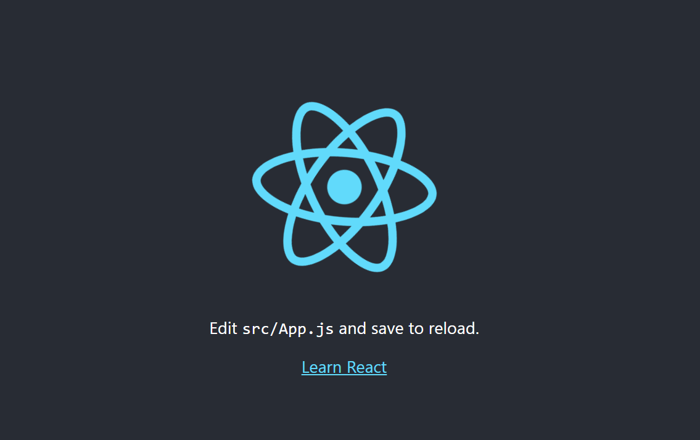

## 간단한 react

<br>

- 설치

```bash
$ npx create-react-app my-app
```

<br>

- 실행

```bash
$ cd my-app
$ npm start
```

<br>

```
my-app/
├─ node_modules/
├─ public/
│  └─ index.html     # React가 렌더링되는 실제 HTML
├─ src/
│  ├─ App.js         # 메인 컴포넌트
│  ├─ App.css        # 스타일
│  ├─ index.js       # 진입점 (ReactDOM.render)
│  └─ logo.svg       # 회전 로고 이미지
└─ package.json      # 의존성 및 npm 스크립트
```

- http://localhost:3000/ 접속



<br>

```bash
$ npm install react-icons
$ npm start
```

<br>

### 패키지 삭제/설치

```bash
$ npm uninstall react-icons
```

- `node_modules/react-icons` 폴더를 삭제하고, 
    
    `package.json`의 `"dependencies"`에서도 이 항목을 제거

<br>

```bash
$ npm install react-icons
```

- `react-icons` 패키지를 npm에서 다시 다운로드하고,

    `node_modules/`에 설치한 뒤

    `package.json`의 `"dependencies"`에 다시 추가